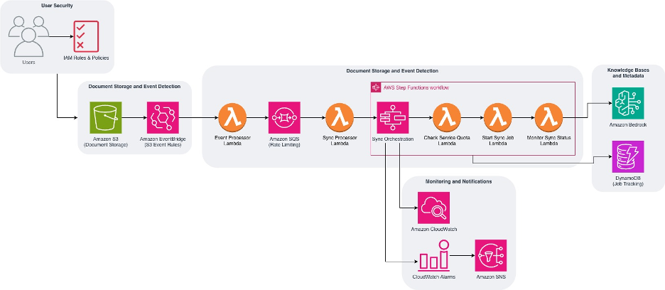

# Amazon Bedrock Knowledge Base Auto-Sync Solution

Copyright Amazon.com, Inc. or its affiliates. All Rights Reserved.
SPDX-License-Identifier: MIT-0

This solution provides automatic synchronization between Amazon S3 and Amazon Bedrock Knowledge Base. This is a sample implementation for testing and evaluation purposes. Before using in production, review and adjust security settings, error handling, and monitoring to meet your organization's requirements. When files are uploaded, updated, or deleted in Amazon S3, the system automatically triggers the sync API call on Amazon Bedrock Knowledge Base, respecting service quotas and implementing best practices.

## Architecture Overview

The solution uses an event-based approach to facilitate document synchronization promptly and reliably. It implements rate limiting and comprehensive error handling to provide a robust synchronization mechanism.



## Important Note About Amazon Bedrock Knowledge Base Ingestion

When you make an API call to `StartIngestionJob`, it ingests **all** the files in the data source, not just specific files. Each ingestion job processes the entire data source. This is a key aspect of how the auto-sync solution works - it tracks changes and triggers full ingestion jobs at optimal times.

## Pre-reqs
1. Create Amazon S3 bucket and an Amazon Bedrock Knowledge Base. (Make sure you have model access to the model selected for the KB. The embedding model must be available through the Amazon Bedrock marketplace.)
2. Turn on Event notifications for Amazon EventBridge on Amazon S3 under properties.

### Amazon S3 Bucket Security Requirements

Before deploying, your Amazon S3 bucket must be configured with the following security settings:
- Block Public Access enabled on the bucket
- Default encryption enabled (SSE-S3 or SSE-KMS)
- Bucket policy requiring SSL/TLS (`aws:SecureTransport` condition)
- Versioning enabled for data protection
- Server access logging enabled for audit trails

Example bucket policy to enforce TLS:
```json
{
  "Effect": "Deny",
  "Principal": "*",
  "Action": "s3:*",
  "Resource": [
    "arn:aws:s3:::your-bucket/*",
    "arn:aws:s3:::your-bucket"
  ],
  "Condition": {
    "Bool": {
      "aws:SecureTransport": "false"
    }
  }
}
```

## Security Considerations

### Shared Responsibility

You are responsible for:
- Configuring IAM roles and policies following least-privilege principles
- Enabling and managing encryption for Amazon S3 buckets (SSE-S3 or SSE-KMS)
- Reviewing and customizing IAM policies created by this template
- Securing access to the Amazon Bedrock Knowledge Base
- Managing KMS key access policies and rotation
- Monitoring and auditing access to all resources

AWS manages:
- Security of the underlying infrastructure for managed services (AWS Lambda, Amazon DynamoDB, Amazon SQS, Amazon SNS, AWS Step Functions)
- Patching and maintenance of managed service platforms
- Physical security of data centers

### Encryption

This solution encrypts data at rest using AWS KMS customer-managed keys:
- Amazon DynamoDB tables use SSE with KMS
- Amazon SQS queues use KMS encryption
- Amazon SNS topics use KMS encryption
- AWS Lambda environment variables are encrypted with KMS

All data in transit is encrypted via HTTPS/TLS through AWS SDK defaults.

### Key Management

- A KMS key is created by the template for data encryption across services
- A separate KMS key is created for AWS Lambda environment variable encryption
- Key rotation is enabled by default
- You are responsible for managing key access policies

### Data Classification

- Metadata Table: Contains job tracking information (internal/operational data)
- Tracking Table: Contains document change records including Amazon S3 keys and bucket names (internal/operational data)
- Amazon SQS messages: Contain knowledge base IDs and document metadata (internal/operational data)
- Amazon SNS notifications: Contain job status summaries (internal/operational data)

### AI Security

This solution uses Amazon Bedrock Knowledge Base for document ingestion and semantic search. You are responsible for:
- Verifying that the embedding model used is available through the Amazon Bedrock marketplace
- Validating documents before uploading to Amazon S3 for ingestion
- Monitoring ingestion job results for unexpected failures
- Reviewing the document corpus for potential bias in search results

### Dataset Compliance

You are responsible for verifying that documents uploaded to Amazon S3 for ingestion:
- Are properly licensed for your intended use
- Comply with your organization's data governance policies
- Do not contain sensitive or restricted content without appropriate controls

## DynamoDB Schema

The solution uses two Amazon DynamoDB tables to track changes and ingestion jobs:

### 1. TRACKING_TABLE

This table tracks individual document changes in Amazon S3:

```json
{
  "change_id": "uuid-or-timestamp",
  "knowledge_base_id": "kb-123456",
  "change_type": "create",
  "key": "key/path/document.pdf",
  "bucket": "bucket-name",
  "timestamp": 1715432871.123,
  "processed": false,
  "ingestion_job_id": "job-123456"
}
```

### 2. METADATA_TABLE

This table tracks information about ingestion jobs:

```json
{
  "job_id": "job-123456",
  "knowledge_base_id": "kb-123456",
  "data_source_id": "ds-123456",
  "status": "COMPLETE",
  "start_time": 1715432871.123,
  "end_time": 1715436471.123,
  "change_count": 50,
  "statistics": {
    "totalDocuments": 1000,
    "successfulDocuments": 995,
    "failedDocuments": 5
  },
  "error": "Error message if any"
}
```

## Complete Workflow

### Phase 1: Document Change Detection

1. **Amazon S3 Document Changes**
   - A user uploads, updates, or deletes a document in the Amazon S3 bucket
   - Amazon S3 generates an event notification for this change

2. **Event-Based Processing**
   - **Amazon EventBridge** captures the Amazon S3 event and routes it to the Event Processor Lambda
   - **Event Processor Lambda** processes the event:
     - Extracts document information (bucket, key, event type)
     - Determines change type (create, update, delete)
     - Creates a tracking entry in Amazon DynamoDB with a unique change_id
     - Sends a change notification to Amazon SQS

### Phase 2: Queue Management and Rate Limiting

3. **Message Queuing**
   - **Amazon SQS queue** receives messages from the Event Processor
   - The queue buffers messages to respect the rate limit (1 request every 10 seconds)

4. **Message Processing**
   - **Sync Processor Lambda** is triggered by the Amazon SQS queue
   - It processes one message at a time to maintain rate limits
   - For each message, it creates metadata entries and starts an AWS Step Functions workflow

### Phase 3: AWS Step Functions Workflow Orchestration

5. **Service Quota Check**
   - **AWS Step Functions** starts the workflow by invoking the Check Quota Lambda
   - **Check Quota Lambda** verifies service quotas:
     - 55 concurrent jobs per account
     - 1 concurrent job per data source
     - 1 concurrent job per knowledge base

6. **Quota Evaluation**
   - **AWS Step Functions** evaluates the quota check results
   - If quotas are exceeded, it waits 5 minutes before retrying
   - If quotas are OK, it proceeds to the next step

7. **Start Sync Job**
   - **AWS Step Functions** invokes the Start Sync Lambda
   - **Start Sync Lambda** initiates the sync job for the entire data source
   - The Lambda updates metadata with job ID and status

8. **Monitor Sync Job**
   - **AWS Step Functions** invokes the Monitor Sync Lambda
   - **Monitor Sync Lambda** checks job status
   - The Lambda updates metadata with current status

9. **Job Status Evaluation**
   - **AWS Step Functions** evaluates if the job is complete
   - If not complete, it waits 60 seconds and checks again
   - If complete, it proceeds to the outcome check

10. **Job Outcome Check**
    - **AWS Step Functions** checks if the job succeeded or failed
    - For successful jobs, it completes the workflow
    - For failed jobs, it marks the workflow as failed

### Phase 4: Knowledge Base Synchronization

11. **Amazon Bedrock Knowledge Base Processing**
    - **Amazon Bedrock Knowledge Base** processes the sync job
    - It ingests all documents from the data source
    - It converts documents to vector embeddings
    - It makes the content available for semantic search

### Phase 5: Monitoring and Notifications

12. **Status Updates**
    - **Monitor Sync Lambda** detects job completion
    - It updates the job status in Amazon DynamoDB
    - It marks all tracked changes as processed by setting the ingestion_job_id

13. **Notifications**
    - **Amazon SNS topic** receives notifications about job completion or failure
    - It sends email notifications to subscribed users

14. **Monitoring**
    - **Amazon CloudWatch dashboard** displays metrics about sync jobs
    - **Amazon CloudWatch alarms** trigger if there are issues

## Example Scenario: User Uploads 50 Files

Let's walk through a concrete example of how the system handles a user uploading 50 files:

1. **User uploads 50 files**
   - Each upload triggers an Amazon S3 event
   - Event Processor Lambda creates a change record in Amazon DynamoDB for each file
   - Each change triggers a message to Amazon SQS

2. **Amazon SQS processes messages with rate limiting**
   - Messages are processed one at a time (1 every 10 seconds)
   - Each message triggers the Sync Processor Lambda

3. **Sync Processor Lambda starts AWS Step Functions workflow**
   - The workflow checks service quotas
   - If quotas are OK, it starts an ingestion job
   - The job processes all files in the data source

4. **Monitor Sync Lambda tracks job progress**
   - When the job completes, it updates the status in Amazon DynamoDB
   - It marks all tracked changes as processed
   - It sends a notification via Amazon SNS

This example demonstrates how the system handles document changes:
- Changes are tracked immediately as they occur
- Ingestion jobs are triggered promptly
- Each ingestion job processes the entire data source, not just the changed files

## Lambda Functions

The solution consists of several AWS Lambda functions that work together to implement the auto-sync functionality:

### 1. Event Processor Lambda (`event_processor_lambda.py`)

**Purpose**: Tracks Amazon S3 events and records changes in Amazon DynamoDB.

**Functionality**:
- Receives Amazon S3 event notifications (via Amazon EventBridge or direct Amazon S3 events)
- Extracts document information (bucket, key, event type)
- Determines the change type (create, update, delete)
- Creates tracking entries in Amazon DynamoDB with unique change_id
- Sends change notifications to Amazon SQS
- Implements error handling and logging

**Environment Variables**:
- `QUEUE_URL`: URL of the Amazon SQS queue
- `KB_PREFIX_MAPPING`: JSON mapping of Amazon S3 prefixes to knowledge base IDs
- `TRACKING_TABLE`: Amazon DynamoDB table for tracking document changes

**Trigger**: Amazon EventBridge rules for Amazon S3 object events

### 2. Sync Processor Lambda (`sync_processor_lambda.py`)

**Purpose**: Processes messages from the Amazon SQS queue and initiates the AWS Step Functions workflow.

**Functionality**:
- Receives messages from Amazon SQS (with rate limiting)
- Creates metadata entries in Amazon DynamoDB for tracking ingestion jobs
- Starts the AWS Step Functions workflow for orchestrating the sync process
- Updates metadata with execution information
- Implements error handling and logging

**Environment Variables**:
- `STEP_FUNCTION_ARN`: ARN of the AWS Step Functions state machine
- `METADATA_TABLE`: Amazon DynamoDB table for tracking sync metadata

**Trigger**: Amazon SQS queue (with appropriate batch size and visibility timeout)

### 3. Check Service Quota Lambda (`check_quota_lambda.py`)

**Purpose**: Verifies that starting a new sync job won't exceed service quotas.

**Functionality**:
- Checks current active ingestion jobs
- Verifies against service quotas:
  - 55 concurrent jobs per account
  - 1 concurrent job per data source
  - 1 concurrent job per knowledge base
- Updates metadata with quota check results
- Returns quota check information to the AWS Step Functions workflow

**Environment Variables**:
- `METADATA_TABLE`: Amazon DynamoDB table for tracking sync metadata

**Trigger**: AWS Step Functions workflow

### 4. Start Sync Lambda (`start_sync_lambda.py`)

**Purpose**: Initiates the sync job with Amazon Bedrock Knowledge Base.

**Functionality**:
- Verifies quota check results
- Makes the StartIngestionJob API call to Amazon Bedrock for the entire data source
- Creates/updates metadata record with job_id as the key
- Implements error handling and logging
- Returns job information to the AWS Step Functions workflow

**Environment Variables**:
- `METADATA_TABLE`: Amazon DynamoDB table for tracking sync metadata

**Trigger**: AWS Step Functions workflow

### 5. Monitor Sync Lambda (`monitor_sync_lambda.py`)

**Purpose**: Tracks job progress and handles completion or failure.

**Functionality**:
- Checks job status using GetIngestionJob API
- Updates metadata with current status and statistics
- Detects terminal states (COMPLETE, FAILED, STOPPED)
- Marks tracked changes as processed when job completes by setting ingestion_job_id
- Sends notifications for job completion or failure
- Implements error handling and logging
- Returns status information to the AWS Step Functions workflow

**Environment Variables**:
- `METADATA_TABLE`: Amazon DynamoDB table for tracking sync metadata
- `TRACKING_TABLE`: Amazon DynamoDB table for tracking document changes
- `NOTIFICATION_TOPIC`: Amazon SNS topic ARN for notifications (optional)

**Trigger**: AWS Step Functions workflow

## Service Quotas Considered

- Concurrent ingestion jobs per account: 55
- Concurrent ingestion jobs per data source: 1
- Concurrent ingestion jobs per knowledge base: 1
- Files to add or update per ingestion job: 5,000,000
- Files to delete per ingestion job: 5,000,000
- GetIngestionJob requests per second: 10
- Ingestion job file size: 50 GB (maximum size per file)
- Ingestion job size: 100 GB (total size of all files in a job)
- ListIngestionJobs requests per second: 10
- StartIngestionJob requests per second: 0.1 (1 request every 10 seconds)

## Deployment

This solution is deployed using an AWS CloudFormation template that creates all the necessary resources:

- AWS Lambda functions
- Amazon SQS queue
- AWS Step Functions state machine
- Amazon DynamoDB tables
- Amazon EventBridge rules
- IAM roles and policies
- Amazon CloudWatch alarms and dashboards
- Amazon SNS topic for notifications

## Usage

After deployment, the solution automatically synchronizes documents between Amazon S3 and Amazon Bedrock Knowledge Base based on the configured mappings. No manual intervention is required for normal operation.

## Monitoring

The solution provides comprehensive monitoring through:

- Amazon CloudWatch dashboards for visualizing sync job metrics
- Amazon CloudWatch alarms for detecting issues
- Amazon SNS notifications for critical events
- Amazon DynamoDB tables for tracking job status and history

## Error Handling

The solution implements robust error handling:

- Exponential backoff for retrying failed jobs
- Dead-letter queues for messages that fail processing
- Detailed error logging in Amazon CloudWatch Logs
- Amazon SNS notifications for critical failures
- Automatic recovery from transient failures

## Troubleshooting

### Events not triggering

1. Verify Amazon EventBridge notifications are enabled on your Amazon S3 bucket

2. Verify the `S3KeyPrefix` parameter matches where you're uploading files. If you set `S3KeyPrefix="files/"`, you must upload to the `files/` prefix in your bucket. If you want to watch the entire bucket, set `S3KeyPrefix=""` (empty string). Note: when passing empty values via CLI, use escaped quotes: `sam deploy --parameter-overrides 'S3KeyPrefix=\"\"'`. Alternatively, set it directly in `samconfig.toml` as `S3KeyPrefix=\"\"`.

3. Check the EventBridge rule in the AWS Console under Amazon EventBridge > Rules. Confirm the pattern matches your bucket name and prefix.

### Lambda errors

Check Amazon CloudWatch Logs for each function. Log group names follow the pattern:
```
/aws/lambda/<stack-name>-event-processor
/aws/lambda/<stack-name>-batch-processor
/aws/lambda/<stack-name>-sync-processor
/aws/lambda/<stack-name>-check-quota
/aws/lambda/<stack-name>-start-sync
/aws/lambda/<stack-name>-monitor-sync
```

### Messages stuck in DLQ

Check the dead-letter queue for failed messages in the AWS Console: Amazon SQS > Queues > `<stack-name>-sync-queue-dlq` > Send and receive messages > Poll for messages.

### KMS permission errors

If you see `KMS.AccessDeniedException` in Lambda logs, verify the Lambda execution role has `kms:Decrypt`, `kms:Encrypt`, and `kms:GenerateDataKey` permissions on the KMS key created by the stack.

### Amazon Bedrock Knowledge Base KMS errors on Amazon S3

If the Amazon Bedrock ingestion job completes but files fail to process, check for errors in the Amazon Bedrock console: Amazon Bedrock > Knowledge bases > your KB > Data source > "Last sync warnings" section, or under Sync history > select the specific ingestion job to view its warnings.

If you see `kms:Decrypt` errors, your bucket is encrypted with a KMS customer-managed key (SSE-KMS). The Bedrock service role needs `kms:Decrypt` permission on that key. You have two options:

1. Grant the Bedrock role access to your bucket's KMS key:
   ```bash
   aws iam put-role-policy \
     --role-name <your-bedrock-kb-execution-role> \
     --policy-name KMSDecryptForS3 \
     --policy-document '{
       "Version": "2012-10-17",
       "Statement": [{
         "Effect": "Allow",
         "Action": "kms:Decrypt",
         "Resource": "arn:aws:kms:<region>:<account-id>:key/<your-key-id>"
       }]
     }'
   ```
   You can find the role name in the Amazon Bedrock console: Amazon Bedrock > Knowledge bases > your KB > Knowledge Base overview > "Service Role".

2. If you use bucket encryption to SSE-S3 (Amazon S3 managed keys), which does not require additional KMS permissions for Amazon Bedrock.

### AWS Step Functions failures

Check execution history in the AWS Console: AWS Step Functions > State machines > `<stack-name>-sync-workflow` > Executions. Filter by "Failed" status to see failed runs and inspect the error details for each step.

## Security

See [CONTRIBUTING](CONTRIBUTING.md#security-issue-notifications) for more information.

## License

This library is licensed under the MIT-0 License. See the LICENSE file.

